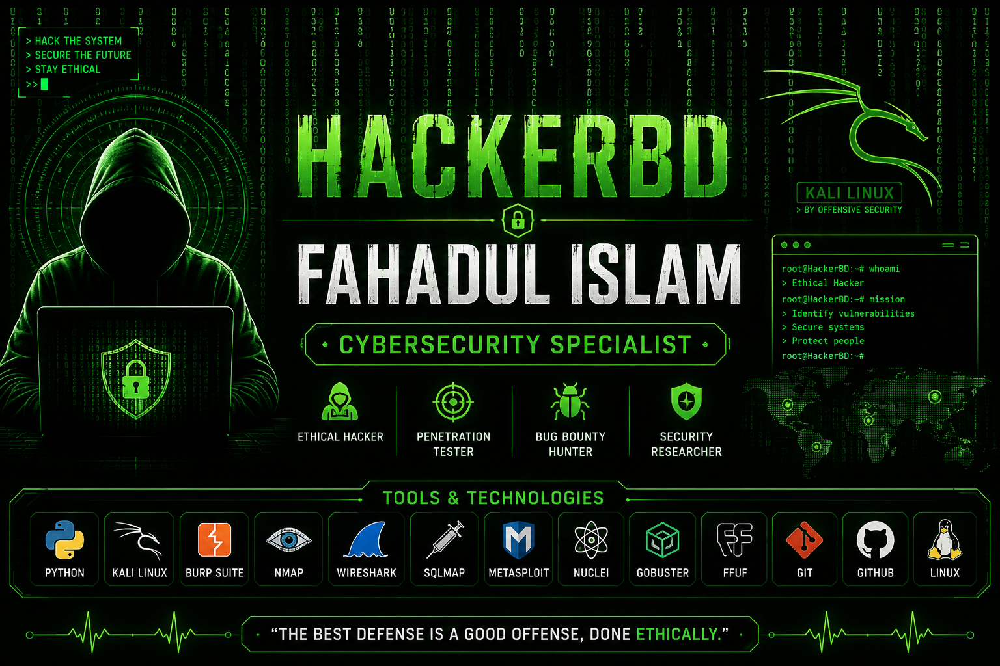

# 👋 Hi, I'm Fahadul Islam

# 🛡️ Cybersecurity Specialist | Ethical Hacker | Penetration Tester | Bug Bounty Hunter

> "Protecting systems through ethical hacking and continuous learning."

---

## 👨‍💻 About Me

- 🔐 Passionate about Cybersecurity & Ethical Hacking
- 🌐 Web Application Penetration Testing
- 🐍 Python Security Automation
- 🛠️ Vulnerability Assessment
- 📚 Continuously learning and improving
- 🌍 Based in Bangladesh

---

# 🌐 Portfolio

🔗 https://fahadulislam1.github.io/cybersecurity-portfolio/

---

# 🛠️ Technical Skills

### Programming
- Python
- HTML
- CSS
- JavaScript
- Bash

### Operating Systems
- Kali Linux
- Ubuntu
- Windows

### Cybersecurity
- Web Penetration Testing
- Network Security
- Vulnerability Assessment
- Bug Bounty
- Security Research
- OSINT

---

# 🔧 Tools

- Burp Suite
- Nmap
- Wireshark
- SQLMap
- FFUF
- Gobuster
- Nuclei
- Amass
- Subfinder
- Httpx
- Nessus
- Metasploit

---

# 📂 Featured Projects

## 🟢 Cybersecurity Portfolio
Professional cybersecurity portfolio website.

## 🟢 AI Pentesting Pipeline
Automation for reconnaissance and vulnerability assessment.

## 🟢 Security Automation Toolkit
Python-based security automation scripts.

## 🟢 Network Security Lab
Learning and testing environment for cybersecurity.

---

# 📫 Contact

📧 Email: fahaduli59@gmail.com

🌐 Portfolio:
https://fahadulislam1.github.io/cybersecurity-portfolio/

💻 GitHub:
https://github.com/Fahadulislam1

---

⭐ Thank you for visiting my profile.
---

## 📊 GitHub Statistics

---

## 🏆 GitHub Trophies

---

